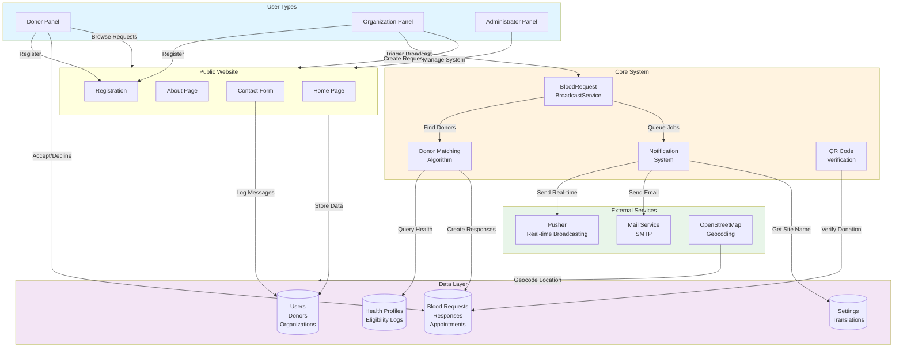
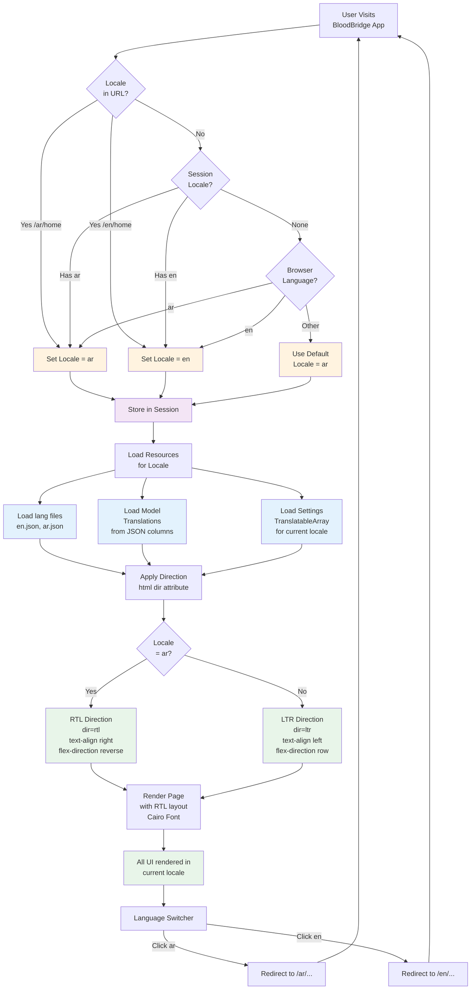
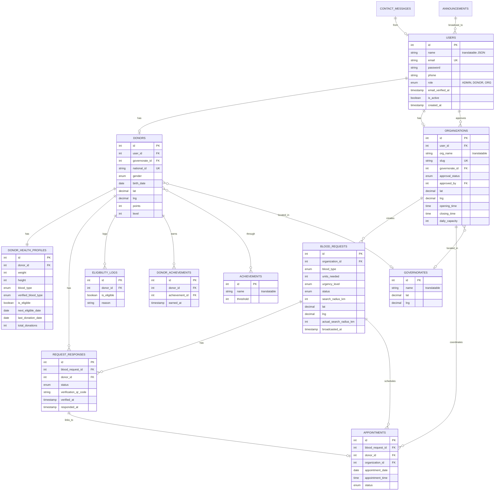
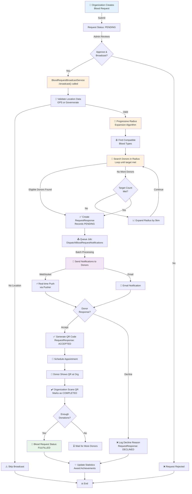
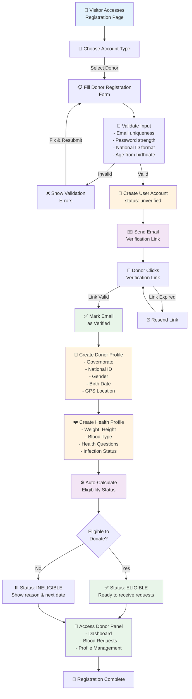
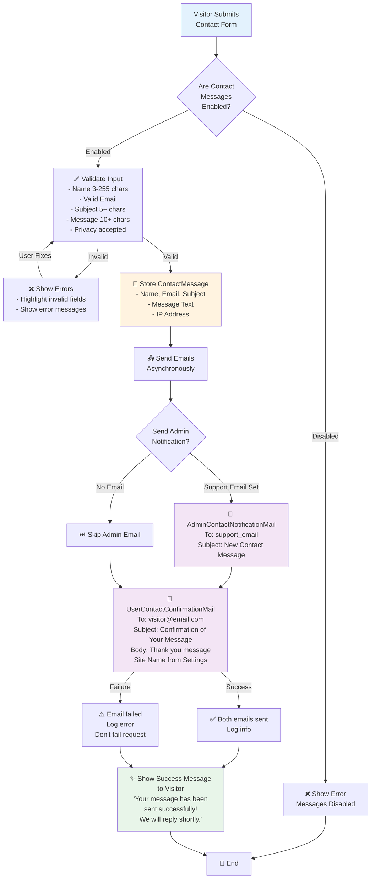
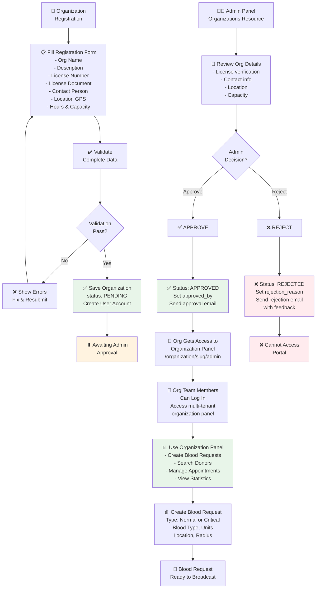
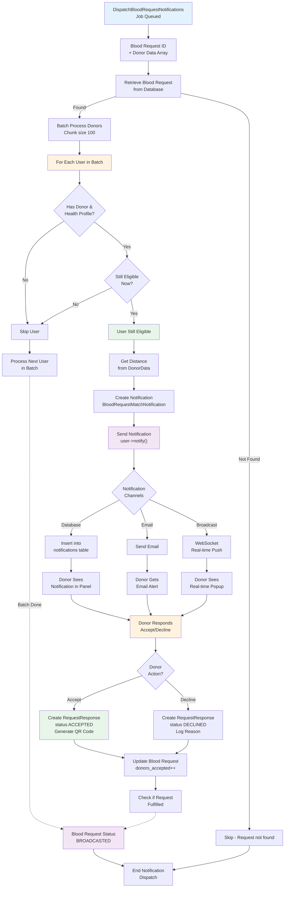
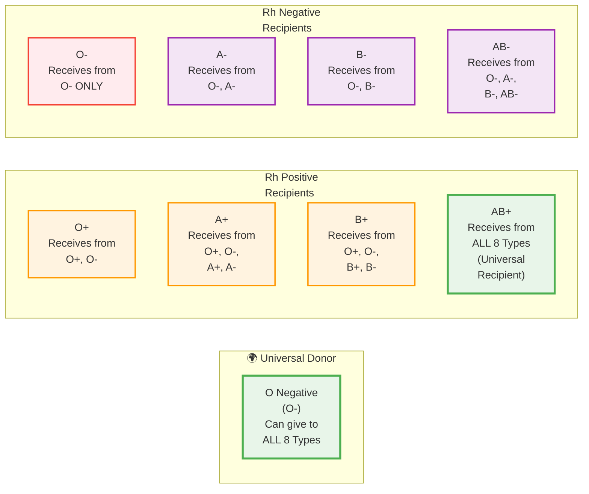

# 🩸 BloodBridge - Complete Project Knowledge Base

**Last Updated:** March 10, 2026
**Project Status:** Under Active Development
**PHP Version:** 8.3+
**Laravel Version:** 12.x
**Filament Version:** 4.x

---

## Table of Contents

1. [Project Overview &amp; Domain Definition](#1-project-overview--domain-definition)
2. [Tech Stack &amp; Dependencies](#2-tech-stack--dependencies)
3. [Localization Architecture](#3-localization-architecture)
4. [Database Schema &amp; Models](#4-database-schema--models)
5. [Filament Admin Panel Structure](#5-filament-admin-panel-structure)
6. [Core Workflows &amp; Logic](#6-core-workflows--logic)
7. [UI/UX &amp; Blade Components](#7-uiux--blade-components)
8. [Services &amp; Business Logic](#8-services--business-logic)
9. [Jobs &amp; Asynchronous Processing](#9-jobs--asynchronous-processing)
10. [Enumerations &amp; Constants](#10-enumerations--constants)
11. [Configuration &amp; Setup](#11-configuration--setup)
12. [Development Patterns &amp; Best Practices](#12-development-patterns--best-practices)

---

## 1. Project Overview & Domain Definition

### What is BloodBridge?

**BloodBridge** is a comprehensive **blood donation management platform** designed to streamline the connection between blood donors and organizations (hospitals, blood banks, medical centers) in need of blood supply. The system is primarily built for the Palestinian context but is designed to scale to other regions.

### Core Mission

> *"To create a seamless, efficient, and life-saving bridge between blood donors and those in critical need through smart technology and real-time communication."*

### Primary Users & Roles

#### 1. **Donors** (فئة المتبرعين)

- **Who**: Individuals willing to donate blood
- **What They Do**:
  - Create and manage donor profiles
  - Track personal health status and donation history
  - Receive real-time notifications when compatible blood is needed nearby
  - Schedule appointment bookings**(Future planned)**
  - View eligibility status and historical records
  - Earn points and badges for contributions**(Future planned)**
  - Access QR codes for quick identification

#### 2. **Organizations** (المنظمات / المستشفيات)

- **Who**: Hospitals, blood banks, medical centers, clinics needing blood supply
- **What They Do**:
  - Create urgent/planned blood requests with specific blood types and quantities
  - Manage blood request lifecycle (pending → broadcasted → fulfilled)
  - Search and filter eligible donors
  - Coordinate appointment scheduling**(Future planned)**
  - Access multi-tenant dashboards with their own data isolation
  - Manage team members **(Future planned)**
  - Track request statistics and donation trends

#### 3. **System Administrators** (المسؤولون)

- **Who**: System operators and platform managers
- **What They Do**:
  - User and organization verification
  - Blood request oversight and monitoring
  - Donor eligibility management
  - System-wide analytics and reporting
  - Configuration and settings management (translatable across languages)
  - Dashboard with key metrics and widgets

### Geographic Context

- **Primary Focus**: Palestinian territories (Governorates mapped in database)
- **Location Services**: GPS coordinates with progressive radius expansion for donor matching
- **Fallback**: Governorate-based matching when GPS unavailable

### System Architecture Overview



---

## 2. Tech Stack & Dependencies

### Core Framework & Language

| Component              | Version | Purpose                            |
| ---------------------- | ------- | ---------------------------------- |
| **PHP**          | 8.3+    | Server-side language               |
| **Laravel**      | 12.x    | Web framework & routing            |
| **Filament**     | 4.x     | Admin/panel UI builder             |
| **Alpine.js**    | 3.4+    | Lightweight frontend interactivity |
| **Tailwind CSS** | 4.x     | Utility-first CSS framework        |
| **Vite**         | 7.x     | Fast module bundler                |

### Critical Dependencies & Their Use Cases

#### **Localization & Internationalization**

```json
"mcamara/laravel-localization": "^2.3"
```

- **Purpose**: Frontend/routing localization with URL prefixes (e.g., `/ar/home`, `/en/contact`)
- **Usage**: Middleware-based URL locale switching, language direction (RTL/LTR) detection
- **Config File**: `config/laravellocalization.php`
- **Integration**: Routes wrapped with `LaravelLocalization::setLocale()` prefix group

```json
"spatie/laravel-translatable": "^6.13"
```

- **Purpose**: Database-level model translation with JSON columns
- **Usage**: Store translatable attributes (e.g., user name, organization description)
- **How It Works**: Uses `$translatable = ['name', ...]` property on models
- **Storage**: JSON object in database column: `{"ar":"نص عربي","en":"English text"}`
- **Access**: Model cast via `Illuminate\Database\Eloquent\Casts\Attribute`

```json
"lara-zeus/spatie-translatable": "1.0"
```

- **Purpose**: Filament UI plugin for spatie/laravel-translatable
- **Integration**: Adds LocaleSwitcher and multi-tab form components to Filament
- **Usage**: Automatic locale tabs in resource forms for managing translations

```json
"filament/spatie-laravel-settings-plugin": "*"
```

- **Purpose**: Filament UI for managing site-wide settings (stored in database)
- **Model**: `App\Settings\GeneralSettings`
- **Features**: Settings dashboard page with multi-tab interface, file uploads, repeaters

#### **Location & Geographic Services**

```json
"dotswan/filament-map-picker": "^2.1"
```

- **Purpose**: Interactive map component in Filament for latitude/longitude selection
- **Usage**: Organizations and blood requests select location via OpenStreetMap
- **Storage**: `lat`, `lng` fields in `organizations` and `blood_requests` tables

#### **QR Code Generation**

```json
"simplesoftwareio/simple-qrcode": "^4.2"
"endroid/qr-code": "^5.0"
```

- **Purpose**: Dual QR code library for:
  - Generating verification QR codes for blood donation verification
  - Quick identification of donors and appointments
- **Service**: `App\Services\QRCodeService`
- **Storage**: QR code as text/encoded in `RequestResponse::verification_qr_code`
- **Expiry**: `RequestResponse::qr_code_expires_at` for security

#### **Real-time Broadcasting & Notifications**

```json
"pusher/pusher-php-server": "^7.2"
```

- **Purpose**: WebSocket-based real-time notifications
- **Usage**: Broadcasting blood request notifications to eligible donors
- **Events**: May use Laravel's broadcasting system for live updates
- **Config**: `config/broadcasting.php` (Pusher credentials in `.env`)

#### **Analytics & Trends**

```json
"flowframe/laravel-trend": "^0.4.0"
```

- **Purpose**: Time-series data analysis library
- **Usage**: Dashboard trend visualizations (donations over time, request patterns)
- **Integration**: Widgets in `app/Filament/Admin/Widgets/`

#### **Admin Panel - Filament Ecosystem**

```json
"bezhansalleh/filament-language-switch": "*"
```

- **Purpose**: Language switcher dropdown in Filament top navbar
- **Usage**: Quick language switching for admin panel (AR/EN)

#### **Testing & Development**

```json
"pestphp/pest": "^4.1"
"fakerphp/faker": "^1.23"
"barryvdh/laravel-debugbar": "^4.0"
"laravel/breeze": "^2.3"
"laravel/pail": "^1.2.2"
```

- **Pest**: Modern Testing Framework
- **Faker**: Fake data generation for testing
- **Debugbar**: Laravel development profiling
- **Breeze**: Authentication scaffolding
- **Pail**: Real-time log viewing

---

## 3. Localization Architecture

### Overview: Dual-Strategy Localization System

BloodBridge implements a **sophisticated two-layer localization system**:

1. **Frontend/Routing Layer**: `mcamara/laravel-localization` for URL-based locale switching
2. **Database Layer**: `spatie/laravel-translatable` for model translations
3. **Custom Integration**: `app/Settings/TranslatableArray` for settings seamless integration

### 3.1 Frontend & Routing Localization

#### Localization Flow Diagram



#### Configuration File: `config/laravellocalization.php`

Only **two locales** are currently enabled:

```php
'supportedLocales' => [
    'en' => ['name' => 'English', 'script' => 'Latn', 'native' => 'English', 'regional' => 'en_GB'],
    'ar' => // Not shown in truncated output, but enabled
]
```

**Supported Locales:**

- `en` - English (Default fallback)
- `ar` - Arabic (RTL)

#### Route Localization: `routes/web.php`

All public routes are wrapped with locale prefix:

```php
Route::group([
    'prefix' => LaravelLocalization::setLocale(),
    'middleware' => ['localeSessionRedirect', 'localizationRedirect', 'localeViewPath']
], function () {
    // All routes here automatically get /en/ or /ar/ prefix
    Route::get('/', [PublicPagesController::class, 'home'])->name('home');
    Route::get('/about', [PublicPagesController::class, 'about'])->name('about');
    Route::post('/contact', [ContactController::class, 'submit'])->name('contact.submit');
});
```

**Middleware Stack:**

- `localeSessionRedirect`: Remembers user's locale preference in session
- `localizationRedirect`: Redirects to appropriate locale if not present
- `localeViewPath`: Loads locale-specific view paths if they exist

#### RTL/LTR Flipping in Layout

**File**: `resources/views/layouts/public.blade.php`

```blade
<html lang="{{ app()->getLocale() }}" dir="{{ \Mcamara\LaravelLocalization\Facades\LaravelLocalization::getCurrentLocaleDirection() }}">
    <head>
        <script>
            window.appConfig = {
                locale: "{{ str_replace('_', '-', app()->getLocale()) }}",
                dir: "{{ app()->getLocale() === 'ar' ? 'rtl' : 'ltr' }}"
            };
        </script>
    </head>
    <body x-data>
        <!-- Content automatically adjusts for RTL -->
    </body>
</html>
```

**How RTL Works:**

- `dir="rtl"` attribute on `<html>` tag for Arabic
- JavaScript global config exposes `window.appConfig.dir` to Alpine.js
- Tailwind CSS handles opposite direction classes automatically
- Font: Cairo Google Font supports both Arabic and English

### 3.2 Database Model Translation with Spatie

#### Key Implementation Pattern

Models like `User`, `Donor`, `Organization`, `BloodRequest` use:

```php
use Spatie\Translatable\HasTranslations;

class User extends Authenticatable
{
    use HasTranslations;
  
    public array $translatable = ['name']; // Mark translatable fields
}
```

#### Storage Format

Translatable fields are stored as **JSON in database**:

```sql
-- users.name column
{"ar": "أحمد محمد", "en": "Ahmed Mohammed"}

-- blood_requests.additional_notes column
{"ar": "ملاحظات إضافية...", "en": "Additional notes..."}
```

#### Accessing Translations

**In Blade/PHP:**

```php
$user->name; // Returns current locale's value (e.g., "Ahmed Mohammed")
$user->name_ar; // Access specific locale
$user->getTranslation('name', 'ar'); // Explicit method
app()->setLocale('ar');
$user->name; // Now returns "أحمد محمد"
```

#### Models with Translations

| Model               | Translatable Fields                                                                  |
| ------------------- | ------------------------------------------------------------------------------------ |
| `User`            | `name`                                                                             |
| `Donor`           | None (inherits through `user`)                                                     |
| `Organization`    | `org_name`, `description`, `responsible_person_position`, `rejection_reason` |
| `BloodRequest`    | `additional_notes`                                                                 |
| `RequestResponse` | `decline_reason`                                                                   |
| `ContactMessage`  | None                                                                                 |

### 3.3 Custom Settings Translation System (Advanced Architecture)

A unique **custom implementation** handles translatable settings without JSON columns per setting:

#### Files Involved:

1. `app/Settings/GeneralSettings.php` - Settings class definition
2. `app/Settings/TranslatableArray.php` - Value object for translatable data
3. `app/Settings/TranslatableArrayCast.php` - Custom cast for Spatie Settings
4. `app/Filament/Admin/Pages/ManageGeneralSettings.php` - Admin UI

#### The Problem This Solves

**Traditional Approach Issues:**

- Each translatable setting requires a JSON column (wasteful)
- `{{ $settings->site_name }}` in Blade doesn't know which locale to use
- Filament form needs complex custom handling

#### The Solution: TranslatableArray Value Object

**GeneralSettings.php:**

```php
class GeneralSettings extends Settings
{
    public mixed $site_name = []; // Stores as TranslatableArray
    public mixed $site_slogan = [];
    public mixed $address = [];
    public mixed $seo_title = [];
    public mixed $seo_description = [];
    // ... 50+ translatable settings
  
    protected static array $translatableFields = [
        'site_name', 'site_slogan', 'address', 'seo_title', 'seo_description',
        // ...
    ];
}
```

**TranslatableArray.php (Key Implementation):**

```php
class TranslatableArray extends \ArrayObject implements \Stringable, Wireable
{
    public function __construct(array|string|null $data = [])
    {
        if (is_string($data)) {
            $data = json_decode($data, true) ?? [];
        }
        parent::__construct((array) $data, \ArrayObject::ARRAY_AS_PROPS);
    }

    // When used as string (in Blade), returns current locale
    public function __toString(): string
    {
        return $this->get(); // Returns site_name in current locale
    }

    public function get(?string $locale = null, bool $fallback = true): string
    {
        $locale = $locale ?: app()->getLocale();
        $data = $this->getArrayCopy();
    
        return isset($data[$locale]) && $data[$locale] !== ''
            ? (string) $data[$locale]
            : (string) ($data['en'] ?? ''); // Fallback to English
    }

    // Works with Livewire (Filament)
    public function toLivewire() { return $this->getArrayCopy(); }
    public static function fromLivewire($value) { return new static($value); }
}
```

**TranslatableArrayCast.php:**

```php
class TranslatableArrayCast implements SettingsCast
{
    public function get($payload): mixed
    {
        return new TranslatableArray($payload); // Wrap in value object
    }
  
    public function set($payload): mixed
    {
        // Convert back to array when saving
        return $payload instanceof TranslatableArray ? $payload->toArray() : $payload;
    }
}
```

#### How It All Works Together

**In Filament Admin Panel:**

```php
// ManageGeneralSettings.php uses tabs for each language
Tabs::make('Settings')->tabs([
    Tab::make('Arabic')
        ->schema([
            TextInput::make('site_name.ar')->label('Site Name (Arabic)')->required(),
        ]),
    Tab::make('English')
        ->schema([
            TextInput::make('site_name.en')->label('Site Name (English)')->required(),
        ]),
])->columnSpanFull(),
```

**In Blade Template:**

```blade
<!-- Automatically returns current locale's value -->
<h1>{{ $settings->site_name }}</h1>
<!-- Or with explicit locale -->
<h1>{{ $settings->site_name->get('ar') }}</h1>
```

**Storage in Database (settings table):**

```json
{
    "key": "site_name",
    "value": {"ar": "الجسر الأحمر", "en": "BloodBridge"},
    "group": "general"
}
```

#### Benefits of This Architecture

1. **Seamless Blade Integration**: `{{ $settings->site_name }}` just works
2. **Admin UI Translation Tabs**: Filament shows locale-specific tabs automatically
3. **No Manual Locale Passing**: Unlike some systems, you don't need to pass locale to templates
4. **Type-Safe**: `TranslatableArray` implements `Stringable`, `JsonSerializable`, `Wireable`
5. **Fallback Support**: Automatically falls back to English if translation missing
6. **Livewire Compatible**: Works seamlessly with Filament/Livewire 3

### 3.4 Language Files: JSON-Based Translations

**Files**: `lang/en.json` and `lang/ar.json`

Unlike traditional Laravel translation files with dot notation (`messages.hello`), BloodBridge uses **Natural English strings as keys**:

```json
{
    "Blood Type": "فصيلة الدم",
    "Are you currently suffering from an infection?": "هل تعاني من عدوى حالياً؟",
    "A smart system connecting donors with those in need": "نظام ذكي يربط المتبرعين بمن يحتاجون إليهم",
    "Every drop counts, every life matters": "كل قطرة مهمة، كل حياة مهمة"
}
```

**Usage in Code:**

```php
__('Blood Type'); // Uses key directly
__('Are you currently suffering from an infection?'); // Translates to Arabic if locale=ar
```

**Advantages:**

- Self-documenting code
- Translations exist right in the key
- Easier to find untranslated strings
- Works naturally with variables: `__('At least :days days must have passed', ['days' => 56])`

---

## 4. Database Schema & Models

### Entity Relationship Diagram (ERD)



### Core Tables & Relationships

#### **users** Table

```
id (PK)
name (translatable JSON)
email (unique)
password (hashed)
phone
role (enum: ADMIN=3, DONOR=1, ORGANIZATION=2)
email_verified_at
is_active (boolean, default=true)
deleted_at (soft delete)
created_at, updated_at
```

**Model**: `App\Models\User`

- Implements: `FilamentUser`, `HasTenants`, `MustVerifyEmail`
- Traits: `HasFactory`, `SoftDeletes`, `Notifiable`, `HasTranslations`
- Relations: `belongsTo('donor')`, `belongsTo('organization')`

#### **donors** Table

```
id (PK)
user_id (FK → users, cascade delete)
governorate_id (FK → governorates, nullable)
national_id (string, length=9, unique, indexed)
gender (enum: MALE=1, FEMALE=2)
birth_date (date, nullable, indexed)
auto_location_address (string, 500 chars)
lat (decimal 10,7, nullable)
lng (decimal 10,7, nullable)
points (unsigned int, default=0) - Loyalty points for achievements
level (unsigned int, default=1) - Donor tier/level
deleted_at (soft delete)
created_at, updated_at
```

**Model**: `App\Models\Donor`

- Traits: `HasFactory`, `SoftDeletes`, `HasTranslations`
- Relations:
  - `belongsTo('user')`
  - `belongsTo('governorate')`
  - `hasOne('health_profile')` → `DonorHealthProfile`
  - `hasMany('responses')` → `RequestResponse`
  - `hasMany('eligibility_logs')` → `EligibilityLog`
- Scopes: `withinRadius(lat, lng, radiusKm, governorateId)` - Haversine formula for distance calculation
- Key Methods: `broadcastToEligibleDonors()`, location-based queries

#### **organizations** Table

```
id (PK)
user_id (FK → users, cascade delete)
org_name (translatable JSON)
slug (unique) - URL-friendly name for multi-tenancy
governorate_id (FK → governorates, nullable)
description (translatable JSON)
license_number (string)
license_document_path (nullable, storage path)
responsible_person_name
responsible_person_position (translatable JSON)
responsible_person_email
contact_email
contact_phone
street_address
auto_location_address (string, 500 chars)
lat (decimal 7) - GPS coordinates
lng (decimal 7)
opening_time (time)
closing_time (time)
working_days (array) - Days of operation
daily_capacity (int) - Number of donors they can process daily
approval_status (enum: PENDING=0, APPROVED=1, REJECTED=2)
approved_by (FK → users, nullable)
rejection_reason (translatable JSON, nullable)
deleted_at (soft delete)
created_at, updated_at
```

**Model**: `App\Models\Organization`

- Implements: `HasName` (Filament contract)
- Traits: `HasFactory`, `SoftDeletes`, `HasTranslations`
- Relations:
  - `belongsTo('user')`
  - `belongsTo('governorate')`
  - `belongsTo('approvedBy', User)`
  - `hasMany('blood_requests')`
- Multi-Tenancy: Uses `slug` for tenant isolation in Filament Organization panel

#### **donor_health_profiles** Table

```
id (PK)
donor_id (FK → donors, cascade delete)
weight (int, kg)
height (int, cm)
blood_type (enum: 9 types + UNKNOWN)
verified_blood_type (nullable, enum)
verified_at (timestamp, nullable)
verified_by_organization_id (nullable, FK)
chronic_disease (boolean, default=false)
recent_donation (boolean, default=false)
infection (boolean, default=false)
is_smoker (boolean, default=false)
has_recent_surgery (boolean, default=false)
surgery_date (date, nullable) - Last surgery date
last_donation_date (date, nullable)
is_eligible (boolean, default=true) - Auto-calculated
next_eligible_date (date, nullable) - When can donate again
total_donations (int, default=0)
deleted_at (soft delete)
created_at, updated_at
```

**Model**: `App\Models\DonorHealthProfile`

- Key Methods:
  - `calculateEligibility()`: Determines if donor can donate now based on rules
  - Auto-calculation on save via `booted()` lifecycle hook
- Eligibility Rules (from GeneralSettings):
  - Min age: 18, Max age: 65
  - Min weight: 50 kg
  - Min height: 140 cm
  - Must wait 56 days between donations
  - Must wait 28 days after surgery
  - No active infection or chronic diseases

#### **blood_requests** Table

```
id (PK)
organization_id (FK → organizations, cascade delete)
blood_type (enum: O+, O-, A+, A-, B+, B-, AB+, AB-, UNKNOWN)
units_needed (int) - Units of blood requested
urgency_level (enum: NORMAL=1, CRITICAL=2)
additional_notes (translatable JSON)
search_radius_km (int) - Initial search radius
lat (float) - Latitude of request location
lng (float) - Longitude for distance calculations
location_address (string)
status (enum: PENDING=0, BROADCASTED=1, FULFILLED=3, CANCELLED=4, EXPIRED=5)
actual_search_radius_km (int, nullable) - Actual radius used after expansion
donors_accepted (int, default=0) - Donors who accepted request
donors_completed (int, default=0) - Donors who completed donation
broadcasted_at (timestamp, nullable)
fulfilled_at (timestamp, nullable)
deleted_at (soft delete)
created_at, updated_at
```

**Model**: `App\Models\BloodRequest`

- Traits: `HasFactory`, `SoftDeletes`, `HasTranslations`
- Relations: `belongsTo('organization')`, `hasMany('responses')`
- Key Methods:
  - `broadcastToEligibleDonors()`: Triggers BloodRequestBroadcastService
  - `wasExpanded()`: Check if radius was expanded
  - Computed attributes: `expansion_steps`, `donors_found`

#### **request_responses** Table

```
id (PK)
blood_request_id (FK → blood_requests)
donor_id (FK → donors)
status (enum: PENDING=0, ACCEPTED=1, DECLINED=2, COMPLETED=3)
verification_qr_code (nullable) - QR code for verification
qr_code_expires_at (timestamp, nullable)
verified_at (timestamp, nullable) - When organization verified donation
decline_reason (translatable JSON, nullable)
responded_at (timestamp, nullable)
appointment_id (FK → appointments, nullable)
created_at, updated_at
```

**Model**: `App\Models\RequestResponse`

- **QR Code Flow**:
  1. When donor accepts: QR code generated
  2. Donor shows QR at organization
  3. Organization scans to verify donation
  4. `verified_at` timestamp set
  5. Appointment linked if scheduled
- Computed Properties:
  - `qr_state_label`: Returns 'فعّال' (Active), 'تم الاستخدام' (Used), 'منتهي' (Expired)
  - `qr_state_color`: Corresponding badge color

#### **appointments** Table(Future planned)

```
id (PK)
blood_request_id (FK → blood_requests)
donor_id (FK → donors)
organization_id (FK → organizations)
appointment_date (date)
appointment_time (time)
status (enum: SCHEDULED=0, COMPLETED=1, CANCELLED=2)
donation_completed_at (timestamp, nullable)
deleted_at (soft delete)
created_at, updated_at
```

**Model**: `App\Models\Appointment`

- Links donors with specific blood requests
- Used for appointment coordination between donor and organization

#### **eligibility_logs** Table

```
id (PK)
donor_id (FK → donors)
is_eligible (boolean)
reason (string) - Reason for eligibility decision
checked_at (timestamp)
created_at, updated_at
```

**Model**: `App\Models\EligibilityLog`

- Audit trail of eligibility decisions
- Tracks when and why donors became eligible/ineligible

#### **contact_messages** Table

```
id (PK)
name (string)
email (email)
subject (string)
message (text)
ip_address (ip)
created_at, updated_at
```

**Model**: `App\Models\ContactMessage`

- Stores public contact form submissions
- Triggers `AdminContactNotificationMail` and `UserContactConfirmationMail`

#### **announcements** Table

```
id (PK)
title (translatable JSON)
content (translatable JSON)
type (string) - Type of announcement
is_active (boolean)
published_at (timestamp, nullable)
deleted_at (soft delete)
created_at, updated_at
```

**Model**: `App\Models\Announcement`

- Platform-wide announcements
- Used for broadcast notifications

#### **achievements** Table(Future planned)

```
id (PK)
name (translatable JSON)
description (translatable JSON)
icon (string) - Icon name/path
threshold (int) - Donations needed to earn
created_at, updated_at
```

**Model**: `App\Models\Achievement`

- Gamification system
- Examples: "First Donor", "10 Donations", "Lifesaver"

#### **donor_achievements** Table(Future planned)

```
id (PK)
donor_id (FK → donors, cascade delete)
achievement_id (FK → achievements)
earned_at (timestamp)
created_at, updated_at
```

**Pivot Model**: `App\Models\DonorAchievement`

- Many-to-many relationship between donors and achievements

#### **governorates** Table

```
id (PK)
name (translatable JSON)
name_en (string)
name_ar (string)
lat (decimal)
lng (decimal)
created_at, updated_at
```

**Model**: `App\Models\Governorate`

- Maps Palestinian governorates for location-based matching
- Used as fallback location when GPS unavailable

#### **settings** Table (Spatie Laravel Settings)

```
id (PK)
group (string) - e.g., 'general'
name (string) - Setting key
value (json) - Setting value (TranslatableArray structure)
created_at, updated_at
```

Stores all `GeneralSettings` data.

### 4.4 Enumerations

BloodBridge uses PHP 8.1+ `Enum` with Filament contracts for type-safe, user-friendly enums:

#### **BloodType**

```php
enum BloodType: int implements HasLabel, HasColor
{
    case O_POSITIVE = 1;    // O+
    case O_NEGATIVE = 2;    // O-
    case A_POSITIVE = 3;    // A+
    case A_NEGATIVE = 4;    // A-
    case B_POSITIVE = 5;    // B+
    case B_NEGATIVE = 6;    // B-
    case AB_POSITIVE = 7;   // AB+
    case AB_NEGATIVE = 8;   // AB-
    case UNKNOWN = 9;       // Unknown
}
```

- **Blood Compatibility**: `getCompatibleDonorTypes()` method returns array of donor blood types that can give to this type
- **Colors**: All types red (`danger`) except UNKNOWN (gray)

#### **UserRole**

```php
enum UserRole: int implements HasLabel, HasColor
{
    case ADMIN = 3;
    case DONOR = 1;
    case ORGANIZATION = 2;
}
```

- **Colors**: ADMIN (danger/red), DONOR (success/green), ORGANIZATION (info/blue)
- **Labels**: Localized via `__()` helper

#### **BloodRequestStatus**

```php
enum BloodRequestStatus: int implements HasLabel, HasColor
{
    case PENDING = 0;       // Awaiting broadcast
    case BROADCASTED = 1;   // Sent to eligible donors
    case FULFILLED = 3;     // Request fulfilled
    case CANCELLED = 4;
    case EXPIRED = 5;
}
```

#### **UrgencyLevel**

```php
enum UrgencyLevel: int implements HasLabel, HasColor
{
    case NORMAL = 1;        // Standard search (2-2.5x donor multiplier)
    case CRITICAL = 2;      // Emergency (3x search radius, 2.5x donor multiplier)
}
```

- **Logic Impact**: Critical requests expand search radius faster, target more donors

#### **Gender**

```php
enum Gender: int
{
    case MALE = 1;
    case FEMALE = 2;
}
```

#### **OrganizationStatus**

```php
enum OrganizationStatus: int implements HasLabel, HasColor
{
    case PENDING = 0;       // Awaiting admin approval
    case APPROVED = 1;      // Verified and active
    case REJECTED = 2;      // Rejected by admin
}
```

#### **RequestResponseStatus**

```php
enum RequestResponseStatus: int implements HasLabel, HasColor
{
    case PENDING = 0;       // Donor hasn't responded
    case ACCEPTED = 1;      // Donor accepted request
    case DECLINED = 2;      // Donor declined
    case COMPLETED = 3;     // Donation completed
}
```

#### **AppointmentStatus**

```php
enum AppointmentStatus: int implements HasLabel, HasColor
{
    case SCHEDULED = 0;
    case COMPLETED = 1;
    case CANCELLED = 2;
}
```

---

## 5. Filament Admin Panel Structure

### Overview: Three-Panel Architecture

#### Multi-Panel System Architecture Diagram

```mermaid
flowchart TB
    subgraph Guest["Guest - Public"]
        Home["Home Page"]
        About["About Page"] 
        Contact["Contact Form"]
        Login["Login"]
        Register["Register"]
    end
  
    subgraph AdminPanel["Admin Panel - /admin"]
        AdminAuth["Admin Authentication"]
        Dashboard_A["Dashboard - System Stats<br/>Recent Activity Metrics"]
        Users_R["Users Resource<br/>List Create Edit<br/>Manage Roles"]
        Orgs_R["Organizations Resource<br/>Verify Orgs<br/>Approve Reject"]
        BloodReq_R["Blood Requests Resource<br/>Monitor Requests<br/>View Analytics"]
        Donors_R["Donors Resource<br/>View Profiles<br/>Manage Eligibility"]
        Settings_R["General Settings<br/>Site Name AR EN<br/>Rules Age Weight<br/>Pages Content"]
        Stats["Statistics Page<br/>Donation Trends<br/>Org Performance"]
    end
  
    subgraph DonorPanel["Donor Panel - /donor"]
        DonorAuth["Donor Authentication"]
        Dashboard_D["Dashboard - My Stats<br/>Donation Count<br/>Next Eligible Date<br/>Achievements"]
        Profile["Edit Profile<br/>Personal Info<br/>Health Profile<br/>Location"]
        Requests["Blood Requests<br/>Active Requests<br/>Accept Decline<br/>My Responses"]
        History["Donation History<br/>Past Donations<br/>Certificates<br/>Timeline"]
        Appointments["Appointments<br/>Scheduled<br/>Completed<br/>Reschedule"]
        QR_Code["My QR Code<br/>Quick ID<br/>Scan at Org"]
    end
  
    subgraph OrgPanel["Organization Panel - /organization/slug"]
        OrgAuth["Org Authentication<br/>Multi-Tenant"]
        Dashboard_O["Org Dashboard - My Stats<br/>Requests Made<br/>Donors Contacted<br/>This Month Donations"]
        CreateRequest["Create Blood Request<br/>Blood Type<br/>Units Needed<br/>Urgency Level<br/>Location Radius<br/>Notes"]
        ManageRequests["Manage Requests<br/>Active Requests<br/>View Donors<br/>Track Responses<br/>Mark Complete"]
        DonorSearch["Donor Search<br/>Filter by Location<br/>Blood Type<br/>Availability<br/>Contact Donors"]
        Appointment_O["Appointments<br/>Schedule<br/>Confirm Donation<br/>Generate QR"]
        Reports["Reports<br/>Donation Stats<br/>Trends<br/>Organization Metrics"]
    end
  
    subgraph Database["Shared Database"]
        Users_DB[("Users")]
        Donors_DB[("Donors<br/>Health Profiles")]
        Orgs_DB[("Organizations")]
        Requests_DB[("Blood Requests<br/>Responses")]
        Appointments_DB[("Appointments")]
        Settings_DB[("Settings")]
        Logs_DB[("Eligibility Logs<br/>Audit Trail")]
    end
  
    Guest -->|Register| Login
    Login -->|Admin| AdminAuth
    Login -->|Donor| DonorAuth
    Login -->|Org| OrgAuth
  
    AdminAuth --> Dashboard_A
    Dashboard_A --> Users_R
    Dashboard_A --> Orgs_R
    Dashboard_A --> BloodReq_R
    Dashboard_A --> Donors_R
    Dashboard_A --> Settings_R
  
    DonorAuth --> Dashboard_D
    Dashboard_D --> Profile
    Dashboard_D --> Requests
    Dashboard_D --> History
    Dashboard_D --> Appointments
    Dashboard_D --> QR_Code
  
    OrgAuth --> Dashboard_O
    Dashboard_O --> CreateRequest
    Dashboard_O --> ManageRequests
    Dashboard_O --> DonorSearch
    Dashboard_O --> Appointment_O
    Dashboard_O --> Reports
  
    Users_R --> Users_DB
    Donors_R --> Donors_DB
    Orgs_R --> Orgs_DB
    BloodReq_R --> Requests_DB
    Settings_R --> Settings_DB
  
    CreateRequest --> Requests_DB
    ManageRequests --> Requests_DB
    DonorSearch --> Donors_DB
    Appointment_O --> Appointments_DB
  
    Profile --> Users_DB
    Profile --> Donors_DB
    History --> Appointments_DB
    Requests --> Requests_DB
  
    Reports --> Logs_DB
    Donors_R --> Logs_DB
  
    style AdminPanel fill:#ffebee
    style DonorPanel fill:#e8f5e9
    style OrgPanel fill:#e3f2fd
    style Database fill:#f3e5f5
```



### Overview: Three-Panel Architecture

BloodBridge implements three separate Filament panels:

| Panel                  | Route                    | Role         | Purpose                                    |
| ---------------------- | ------------------------ | ------------ | ------------------------------------------ |
| **Admin**        | `/admin`               | ADMIN        | System management, statistics, approvals   |
| **Donor**        | `/donor`               | DONOR        | Personal profile, requests, appointments   |
| **Organization** | `/organization/{slug}` | ORGANIZATION | Blood requests, donor search, multi-tenant |

### 5.1 Admin Panel (`app/Filament/Admin/`)

#### Structure

```
Admin/
├── Pages/
│   ├── Dashboard.php          # Main admin dashboard
│   ├── Statistics.php         # Analytics page
│   └── ManageGeneralSettings.php  # Translatable settings
├── Resources/
│   ├── Donors/
│   │   ├── DonorResource.php
│   │   ├── Pages/
│   │   │   ├── CreateDonor.php
│   │   │   ├── EditDonor.php
│   │   │   ├── ListDonors.php
│   │   │   └── ViewDonor.php
│   │   ├── RelationManagers/
│   │   │   └── ResponsesRelationManager.php
│   │   ├── Schemas/
│   │   │   ├── DonorForm.php
│   │   │   └── DonorInfolist.php
│   │   └── Tables/
│   │       └── DonorsTable.php
│   ├── Organizations/        # Similar structure
│   ├── BloodRequests/        # Similar structure
│   ├── Users/                # Similar structure
│   ├── ContactMessages/      # Similar structure
│   └── Announcements/        # Similar structure
├── Traits/
│   └── HasAdminPanel.php     # Shared admin functionality
└── Widgets/
    └── Various dashboard widgets for metrics
```

#### Key Components

**DonorResource.php** Example:

```php
class DonorResource extends Resource
{
    protected static ?string $model = Donor::class;
    protected static string|BackedEnum|null $navigationIcon = 'heroicon-o-heart';

    public static function getNavigationLabel(): string
    {
        return __('filament.resources.donors.title');
    }

    public static function getNavigationGroup(): ?string
    {
        return __('filament.navigation.users');
    }
  
    public static function table(Table $table): Table
    {
        return $table
            ->columns(DonorsTable::getColumns())
            ->filters(DonorsTable::getFilters())
            ->actions(DonorsTable::getActions())
            ->bulkActions(DonorsTable::getBulkActions());
    }
}
```

**ManageGeneralSettings.php** (Critical for Localization):

```php
class ManageGeneralSettings extends SettingsPage
{
    protected static string $settings = GeneralSettings::class;

    public function form(Schema $schema): Schema
    {
        return $schema->components([
            Tabs::make('Settings')->tabs([
                Tab::make('System Rules')
                    ->schema([
                        Section::make(__('Donor Eligibility'))
                            ->schema([
                                TextInput::make('min_donor_age'),
                                TextInput::make('max_donor_age'),
                                TextInput::make('min_days_between_donations'),
                                // ... More settings
                            ]),
                    ]),
            
                Tab::make('Identity & System')
                    ->schema([
                        Tabs::make('Site Identity Tabs')->tabs([
                            Tab::make('Arabic')->schema([
                                TextInput::make('site_name.ar')->required(),
                                TextInput::make('site_slogan.ar'),
                            ]),
                            Tab::make('English')->schema([
                                TextInput::make('site_name.en')->required(),
                                TextInput::make('site_slogan.en'),
                            ]),
                        ]),
                        FileUpload::make('site_logo')->image(),
                        FileUpload::make('site_favicon'),
                    ]),
            
                // ... More tabs for SEO, Home page, About page, etc.
            ]),
        ]);
    }
}
```

### 5.2 Donor Panel (`app/Filament/Donor/`)

#### Structure

```
Donor/
├── Pages/
│   ├── Dashboard.php          # Donor dashboard with stats
│   ├── EditProfile.php        # Edit personal info
│   ├── History.php            # Donation history
│   ├── BloodRequests.php      # View active requests
│   ├── ChangePassword.php     # Password change
│   └── IneligibleDonor.php    # Eligibility explanation page
├── Resources/
│   └── Minimal resources (mostly read-only for donors)
└── Widgets/
    └── Dashboard widget cards
```

#### Key Features

- **Personal Dashboard**: Shows donation count, next eligible date, achievements
- **Notification Management**: View and respond to blood requests
- **QR Code Display**: Personal QR for identification at appointments
- **Health Profile**: View/edit health information (if allowed)

### 5.3 Organization Panel (`app/Filament/Organization/`)

#### Structure

```
Organization/
├── Pages/
│   ├── Dashboard.php          # Organization dashboard
│   └── More pages...
├── Resources/
│   ├── BloodRequests/        # Create/manage blood requests
│   ├── Donors/               # Search and view donors
│   └── Appointments/         # Manage appointments
└── Widgets/
    └── Organization-specific statistics
```

#### Multi-Tenancy Implementation

- **Tenant Model**: `Organization` (via `slug`)
- **Access Control**: Users can only access their own organization's data
- **URL Pattern**: `/organization/{slug}/admin/...`
- **Filament Setup**: `Panel::tenantRoutePrefix('organization')->tenantRouteParameterName('tenant')`

---

## 6. Core Workflows & Logic

### 6.1 Blood Request Broadcasting & Donor Matching

This is the **heart of BloodBridge's intelligence system**.

#### High-Level Flow Diagram



#### Service: `App\Services\BloodRequestBroadcastService`

**Configuration Constants:**

```php
private const DONOR_SAFETY_MULTIPLIER_NORMAL = 2.0;      // Aim for 2x units needed
private const DONOR_SAFETY_MULTIPLIER_CRITICAL = 2.5;    // Aim for 2.5x units needed
private const CRITICAL_RADIUS_MULTIPLIER = 3;             // Start with 3x radius for critical
private const RADIUS_EXPANSION_STEP_KM = 5;               // Expand by 5km each step
private const MAX_SEARCH_RADIUS_KM = 25;                  // Don't exceed 25km
private const NOTIFICATION_COOLDOWN_CRITICAL_HOURS = 0.5; // Can notify again after 30 mins
private const NOTIFICATION_COOLDOWN_NORMAL_HOURS = 2.0;   // Can notify again after 2 hours
```

**Main Method: `broadcast(BloodRequest $bloodRequest): int`**

```php
public function broadcast(BloodRequest $bloodRequest): int
{
    if (!$this->hasValidLocation($bloodRequest)) {
        return 0; // Fail silently if no location
    }

    try {
        $eligibleDonors = DB::transaction(function () use ($bloodRequest) {
            // Find all eligible donors with progressive expansion
            $donors = $this->findEligibleDonorsWithExpansion($bloodRequest);
        
            // Mark request as broadcasted
            $this->updateBroadcastStatus($bloodRequest);
        
            return $donors;
        });

        // Queue notifications asynchronously
        $notificationsQueued = $this->notifyEligibleDonors($bloodRequest, $eligibleDonors);

        Log::info('Blood request broadcasted', [
            'blood_request_id' => $bloodRequest->id,
            'donors_found' => $eligibleDonors->count(),
            'notifications_queued' => $notificationsQueued,
        ]);

        return $eligibleDonors->count();
    } catch (\Exception $e) {
        Log::error('Failed to broadcast blood request', [
            'blood_request_id' => $bloodRequest->id,
            'error' => $e->getMessage(),
        ]);
        throw $e;
    }
}
```

#### Progressive Radius Expansion Algorithm

**Why Progressive Expansion?**

- Maximizes local donor usage (better for donors, logistics)
- Reduces "notification fatigue" on distant donors
- Honors urgency levels with different expansion speeds

**Algorithm:**

```php
private function findEligibleDonorsWithExpansion(BloodRequest $bloodRequest): Collection
{
    // 1. Get compatible blood types (e.g., A+ can give to A+, AB+)
    $compatibleBloodTypes = $bloodRequest->blood_type->getCompatibleDonorTypes();
  
    // 2. Determine if request is critical
    $isCritical = $this->isCriticalRequest($bloodRequest);
  
    // 3. Calculate target donor count
    // Target = Units Needed × Safety Multiplier
    $targetDonorCount = $this->calculateTargetDonorCount($bloodRequest, $isCritical);
  
    // 4. Start with initial radius
    // CRITICAL: start at 3x requested radius
    // NORMAL: start at requested radius
    $currentRadius = $this->getInitialSearchRadius($bloodRequest, $isCritical);

    $matchedDonors = collect();
    $expansionAttempts = 0;

    // 5. Loop while not enough donors found
    while ($this->shouldContinueExpansion($matchedDonors, $targetDonorCount, $currentRadius)) {
        // Search donors in current radius
        $newDonors = $this->searchDonorsInRadius(
            $bloodRequest,
            $compatibleBloodTypes,
            $currentRadius,
            $isCritical,
            $excludedDonorIds // Already found donors
        );

        // Accumulate results
        $matchedDonors = $matchedDonors->merge($newDonors);
    
        // Check if we have enough
        if ($this->targetDonorCountMet($matchedDonors, $targetDonorCount)) {
            break;
        }

        // Expand radius by 5km
        $currentRadius += self::RADIUS_EXPANSION_STEP_KM;
    
        // Don't exceed max radius
        if ($currentRadius >= self::MAX_SEARCH_RADIUS_KM) {
            break;
        }

        $expansionAttempts++;
    }

    // 6. Save expansion metadata
    $this->saveExpansionResults($bloodRequest, $currentRadius);

    return $matchedDonors;
}
```

**Eligibility Criteria for Donors:**

1. **Blood Type**: Compatible with request
2. **Medical Eligibility**: `DonorHealthProfile::is_eligible = true`
3. **Cooldown Period**: Next eligible date is today or in the past
4. **Notification Cooldown**: Hasn't been notified about request in past 30 min (critical) or 2 hours (normal)
5. **Active Account**: `User::is_active = true`, email verified
6. **Geographic**: Within current search radius (Haversine formula)

**Database Haversine Query:**

```php
$haversine = "(
    6371 * acos(
        cos(radians($lat))
        * cos(radians(donors.lat))
        * cos(radians(donors.lng) - radians($lng))
        + sin(radians($lat))
        * sin(radians(donors.lat))
    )
)";

$query->whereBetween(DB::raw($haversine), [0, $radiusKm]);
```

#### Notification Job: `App\Jobs\DispatchBloodRequestNotifications`

```php
class DispatchBloodRequestNotifications implements ShouldQueue
{
    const MAX_BATCH_SIZE = 100; // Prevent queue payload overflow

    public function __construct(
        public int $bloodRequestId,
        public array $donorData // Format: ['user_id' => distance, ...]
    ) {}

    public function handle(): void
    {
        $bloodRequest = BloodRequest::find($this->bloodRequestId);
        if (!$bloodRequest) return;

        // Batch process to avoid N+1 queries
        User::with('donor.health_profile')
            ->whereIn('id', array_keys($this->donorData))
            ->chunk(10, function ($users) use ($bloodRequest) {
                foreach ($users as $user) {
                    // Double-check eligibility (may have changed since broadcasting)
                    $healthProfile = $user->donor?->health_profile;
                
                    if (!$healthProfile?->is_eligible || 
                        ($healthProfile->next_eligible_date && 
                         $healthProfile->next_eligible_date->startOfDay()->isFuture())) {
                        continue;
                    }

                    // Send notification
                    $distance = $this->donorData[$user->id];
                    $user->notify(new BloodRequestMatchNotification($bloodRequest, $distance));
                }
            });
    }

    // For batch dispatching to avoid queue payload limits
    public static function dispatchBatches(int $bloodRequestId, array $donorData): void
    {
        $chunks = array_chunk($donorData, self::MAX_BATCH_SIZE, true);
        foreach ($chunks as $chunk) {
            self::dispatch($bloodRequestId, $chunk);
        }
    }
}
```

### 6.2 Donor Registration & Health Profile Setup

#### Donor Registration Flow Diagram



#### Registration Flow: Multi-Step Process

**Step 1: Role Selection** (`POST /register_selection`)

- Donor or Organization choice

**Step 2: Account Creation** (`POST /register/donor`)

```php
// RegisteredUserController::storeDonor()
// Validates:
// - Email uniqueness
// - Password strength (8+ chars, numbers, letters)
// - Age from birthdate validation
// - National ID format (9 digits)

$user = User::create([
    'name' => $request->name,
    'email' => $request->email,
    'password' => Hash::make($request->password),
    'phone' => $request->phone,
    'role' => UserRole::DONOR,
    'is_active' => true,
]);

// Email verification sent here
$user->sendEmailVerificationNotification();
```

**Step 3: Donor Profile Creation** (Automatically created after registration)

```php
$donor = Donor::create([
    'user_id' => $user->id,
    'governorate_id' => $request->governorate_id,
    'national_id' => $request->national_id,
    'gender' => Gender::from($request->gender),
    'birth_date' => $request->birth_date,
    'lat' => $request->lat ?? null,
    'lng' => $request->lng ?? null,
    'auto_location_address' => $request->location_address,
]);
```

**Step 4: Health Profile Creation** (Triggered by event or API)

```php
$healthProfile = DonorHealthProfile::create([
    'donor_id' => $donor->id,
    'weight' => $request->weight,
    'height' => $request->height,
    'chronic_disease' => $request->chronic_disease === 'yes',
    'infection' => $request->infection === 'yes',
    'is_smoker' => $request->is_smoker === 'yes',
    // is_eligible calculated automatically on save
]);
```

**Eligibility Calculation on Save:**

```php
// DonorHealthProfile::booted()
static::saving(function (DonorHealthProfile $profile) {
    $eligibility = $profile->calculateEligibility();
    $profile->is_eligible = $eligibility['is_eligible'];
    $profile->next_eligible_date = $eligibility['next_eligible_date'];
});

// Calculation logic
public function calculateEligibility(): array
{
    $today = Carbon::now()->startOfDay();
    $settings = app(GeneralSettings::class);

    $age = $this->donor->birth_date->diffInYears($today);
  
    // Basic rules
    if ($age < $settings->min_donor_age || $age > $settings->max_donor_age) {
        return [
            'is_eligible' => false,
            'next_eligible_date' => null, // Never eligible due to age
        ];
    }

    if ($this->weight < $settings->min_donor_weight) {
        return ['is_eligible' => false, 'next_eligible_date' => null];
    }

    // Temporary ineligibility reasons
    $nextEligibleDate = null;

    if ($this->chronic_disease || $this->infection) {
        return ['is_eligible' => false, 'next_eligible_date' => null];
    }

    if ($this->has_recent_surgery) {
        $nextEligibleDate = $this->surgery_date->addDays($settings->min_days_after_surgery);
    }

    if ($this->recent_donation && $this->last_donation_date) {
        $donationEligibilityDate = $this->last_donation_date->addDays(
            $settings->min_days_between_donations
        );
        $nextEligibleDate = $nextEligibleDate 
            ? max($nextEligibleDate, $donationEligibilityDate)
            : $donationEligibilityDate;
    }

    $isEligible = is_null($nextEligibleDate) || $nextEligibleDate->startOfDay()->isPast();

    return [
        'is_eligible' => $isEligible,
        'next_eligible_date' => $nextEligibleDate,
    ];
}
```

### 6.3 Contact Form Flow

**Controller**: `App\Http\Controllers\ContactController`

#### Contact Form Process Flowchart



#### Step-by-Step Processing

```php
public function submit(Request $request, GeneralSettings $settings)
{
    // 1. Check if enabled
    if (!$settings->enable_contact_messages) {
        return back()->with('error', __('Contact messages are disabled'));
    }

    // 2. Validate input
    $validated = $request->validate([
        'name' => ['required', 'string', 'min:3', 'max:255'],
        'email' => ['required', 'email'],
        'subject' => ['required', 'string', 'min:5'],
        'message' => ['required', 'string', 'min:10'],
        'privacy' => ['accepted'], // Privacy policy checkbox
    ]);

    // 3. Store message in database
    $contactMessage = ContactMessage::create([
        'name' => $validated['name'],
        'email' => $validated['email'],
        'subject' => $validated['subject'],
        'message' => $validated['message'],
        'ip_address' => $request->ip(), // For security/spam tracking
    ]);

    // 4. Send emails (handled gracefully if fails)
    try {
        $settings = app(GeneralSettings::class);
        $supportEmail = $settings->support_email ?? 'admin@bloodbridge.com';
        $siteName = $settings->site_name; // TranslatableArray - auto-returns current locale

        // 4a. Notify admin
        if ($supportEmail) {
            Mail::to($supportEmail)->send(
                new AdminContactNotificationMail($contactMessage)
            );
        }

        // 4b. Confirm to user
        Mail::to($contactMessage->email)->send(
            new UserContactConfirmationMail($contactMessage, (string) $siteName)
        );
    } catch (\Exception $e) {
        Log::error('Failed to send contact emails: ' . $e->getMessage());
        // Don't fail the request - user message is stored
    }

    return back()->with('success', __('Your message has been sent!'));
}
```

#### Mail Classes

**UserContactConfirmationMail.php:**

```php
class UserContactConfirmationMail extends Mailable
{
    public function __construct(
        public ContactMessage $contactMessage,
        public string $siteName // Site name for templating
    ) {}

    public function envelope(): Envelope
    {
        return new Envelope(
            subject: __('Confirmation of Your Message') . ' - ' . $this->siteName,
        );
    }

    public function content(): Content
    {
        return new Content(
            view: 'emails.user-contact-confirmation',
            with: ['siteName' => $this->siteName],
        );
    }
}
```

**AdminContactNotificationMail.php:**

```php
class AdminContactNotificationMail extends Mailable
{
    public function __construct(public ContactMessage $contactMessage) {}

    public function envelope(): Envelope
    {
        return new Envelope(
            subject: __('New Contact Message') . ': ' . $this->contactMessage->subject,
        );
    }

    public function content(): Content
    {
        return new Content(view: 'emails.admin-contact-notification');
    }
}
```

### 6.4 Organization Registration & Approval

#### Organization Registration & Approval Flowchart



#### Registration Process

**Step 1: Select Organization Role** → **Step 2: Form Submission**

```php
// RegisteredUserController::storeOrganization()
$organization = Organization::create([
    'user_id' => $user->id,
    'org_name' => $request->org_name,
    'slug' => Str::slug($request->org_name), // For multi-tenancy
    'governorate_id' => $request->governorate_id,
    'description' => $request->description,
    'license_number' => $request->license_number,
    'license_document_path' => $request->file('license_document')?->store('licenses'),
    'responsible_person_name' => $request->responsible_person_name,
    'responsible_person_position' => $request->responsible_person_position,
    'responsible_person_email' => $request->responsible_person_email,
    'contact_email' => $request->contact_email,
    'contact_phone' => $request->contact_phone,
    'street_address' => $request->street_address,
    'lat' => $request->lat,
    'lng' => $request->lng,
    'opening_time' => $request->opening_time,
    'closing_time' => $request->closing_time,
    'working_days' => $request->working_days, // Array of days
    'daily_capacity' => $request->daily_capacity,
    'approval_status' => OrganizationStatus::PENDING, // Default status
]);
```

#### Admin Approval Workflow

**In Admin Panel:**

```
Organizations Resource → List View
  ↓
Admin clicks "Review" → Edit page
  ↓
Approve: Sets approval_status = APPROVED, approved_by = admin user
  ↓
Organization gets access to `/organization/{slug}/admin`
  ↓
All organization users get organization panel access
```

---

## 7. UI/UX & Blade Components

### 7.1 View / Template Structure

```
resources/views/
├── auth/                      # Authentication pages
│   ├── login.blade.php
│   ├── register.blade.php
│   └── ...
├── components/                # Reusable Blade components
│   ├── navbar.blade.php       # Main navigation
│   ├── footer.blade.php       # Site footer
│   ├── modal.blade.php        # Modal dialogs
│   ├── eligibility-modal.blade.php  # Eligibility check modal
│   ├── privacy-modal.blade.php      # Privacy policy modal
│   ├── primary-button.blade.php
│   ├── secondary-button.blade.php
│   ├── text-input.blade.php
│   ├── input-error.blade.php
│   └── ... (other UI components)
├── layouts/
│   ├── app.blade.php          # Authenticated user layout
│   ├── guest.blade.php        # Guest layout
│   ├── public.blade.php       # Public pages layout (RTL/LTR aware)
│   └── navigation.blade.php   # Navigation shared components
├── pages/                     # Full pages
│   ├── home.blade.php
│   ├── about.blade.php
│   ├── contact.blade.php
│   ├── eligibility.blade.php
│   └── ...
├── emails/                    # Mail templates
│   ├── user-contact-confirmation.blade.php
│   └── admin-contact-notification.blade.php
├── filament/                  # Custom Filament pages/components
│   └── ...
├── dashboard.blade.php        # Dashboard page
├── profile/                   # User profile pages
│   └── ...
├── test-matching.blade.php    # Testing/development page
└── vendor/                    # Third-party layout overrides
```

### 7.2 Public Layout: `public.blade.php`

**Key Features:**

- RTL/LTR dynamic direction
- Automatic locale switching
- SEO meta tags from settings
- Settings-based site title, description, favicon
- Alpine.js integration via `x-data`
- Tailwind CSS + custom assets

```blade
<html lang="{{ app()->getLocale() }}" dir="{{ LaravelLocalization::getCurrentLocaleDirection() }}">
    <head>
        <!-- Dynamic meta tags from settings -->
        <meta name="description" content="{{ $settings->seo_description }}" />
        <meta name="keywords" content="{{ $settings->seo_keywords }}" />
        <title>{{ $settings->seo_title ?? __(':site_name - Saving lives drop by drop', 
            ['site_name' => $settings->site_name]) }}</title>
    
        <!-- Favicon from settings -->
        <link rel="icon" href="{{ Storage::disk('public')->url($settings->site_favicon) }}" />
    
        <!-- Cairo font for Arabic/English -->
        <link href="https://fonts.googleapis.com/css2?family=Cairo:wght@400;600;700;800&display=swap" rel="stylesheet" />
    
        <!-- Custom CSS & Tailwind via Vite -->
        @vite(['resources/css/app.css', 'resources/js/app.js'])
    </head>
    <body x-data>
        <x-navbar />
        <main>{{ $slot }}</main>
        <x-footer />
        <x-privacy-modal />
        <x-eligibility-modal />
    </body>
</html>
```

### 7.3 Component Architecture

#### `x-navbar` Component

```blade
<nav class="{{ app()->getLocale() === 'ar' ? 'rtl' : 'ltr' }}">
    <div class="container">
        <!-- Logo with site name from settings -->
        url($settings->site_logo) }}" 
             alt="{{ $settings->site_name }}" height="40" />
    
        <!-- Language Switcher -->
        <div class="language-switcher">
            <a href="{{ route('home', ['locale' => 'ar']) }}">العربية</a>
            <a href="{{ route('home', ['locale' => 'en']) }}">English</a>
        </div>
    
        <!-- Navigation links (with locale prefix) -->
        <ul>
            <li><a href="{{ route('home') }}">@lang('Home')</a></li>
            <li><a href="{{ route('about') }}">@lang('About')</a></li>
            <li><a href="{{ route('contact') }}">@lang('Contact')</a></li>
        </ul>
    
        <!-- Auth links -->
        @if (auth()->check())
            <!-- User dropdown with role-specific dashboard link -->
            <a href="{{ auth()->user()->getDashboardUrl() }}">@lang('Dashboard')</a>
        @else
            <a href="{{ route('login') }}">@lang('Login')</a>
            <a href="{{ route('register.selection') }}">@lang('Register')</a>
        @endif
    </div>
</nav>
```

#### `x-eligibility-modal` Component

Modal that explains donor eligibility requirements from GeneralSettings.

- Triggered on donor registration page
- Shows age, weight, health requirements
- Populated dynamically from settings

#### `x-privacy-modal` Component

Privacy policy modal from settings.

- Shown during contact form
- Checkbox required before submission

### 7.4 CSS & Styling Strategy

#### Structure

```
public/assets/
├── styles/
│   ├── main.css           # Entry point
│   ├── layout/
│   │   ├── navbar.css
│   │   └── footer.css
│   └── pages/
│       ├── home.css
│       ├── about.css
│       └── contact.css
├── scripts/
│   └── pages/
│       └── index.js       # Alpine.js initialization
└── images/               # Static images, logos
```

#### Tailwind Integration with Vite

```javascript
// resources/css/app.css
@import "tailwindcss";

@layer components {
    .btn-primary { @apply px-4 py-2 bg-red-600 text-white rounded; }
    .btn-secondary { @apply px-4 py-2 bg-gray-300 text-black rounded; }
}
```

#### RTL Handling

- **Approach**: CSS logical properties + Tailwind's LTR/RTL modifiers
- **Example**: `ltr:ml-4 rtl:mr-4` (margin-left in LTR, margin-right in RTL)
- **Navbar**: Flex direction reverses automatically with `dir="rtl"`

### 7.5 JavaScript & Alpine.js

#### Entry Point: `resources/js/app.js`

```javascript
import Alpine from 'alpinejs';

// Language switching without page reload
Alpine.data('languageSwitcher', () => ({
    switchLocale(locale) {
        // AJAX request to switch locale
        fetch(`/api/locale/${locale}`, { method: 'POST' })
            .then(() => location.reload());
    }
}));

// Contact form handling
Alpine.data('contactForm', () => ({
    isSubmitting: false,
    async submit(e) {
        e.preventDefault();
        this.isSubmitting = true;
        const response = await fetch('/contact', {
            method: 'POST',
            body: new FormData(e.target),
        });
        this.isSubmitting = false;
        // Handle response
    }
}));

Alpine.start();
```

#### Usage in Blade

```blade
<form @submit="contactForm.submit($event)">
    <input type="text" name="name" required />
    <button type="submit" :disabled="contactForm.isSubmitting">
        {{ contactForm.isSubmitting ? 'Sending...' : 'Send' }}
    </button>
</form>
```

---

## 8. Services & Business Logic

### 8.1 `BloodRequestBroadcastService`

**File**: `app/Services/BloodRequestBroadcastService.php`

Already detailed in Section 6.1 - Core Workflows.

### 8.2 `BloodRequestActionService`

**Purpose**: Handle donor responses and actions on blood requests

**Key Methods:**

- `acceptRequest(RequestResponse $response)`: Mark donor response as accepted
- `declineRequest(RequestResponse $response, string $reason)`: Mark as declined
- `completeRequest(RequestResponse $response)`: Mark donation as completed
- `generateQRCode(RequestResponse $response)`: Generate verification QR code
- `verifyQRCode(string $qrCode)`: Verify QR and mark donation complete

### 8.3 `QRCodeService`

**Purpose**: QR code generation and verification

```php
class QRCodeService
{
    public function generateCode(RequestResponse $response): string
    {
        $data = json_encode([
            'request_id' => $response->blood_request_id,
            'donor_id' => $response->donor_id,
            'timestamp' => now()->toIso8601String(),
            'hash' => hash('sha256', $response->id . env('APP_KEY')),
        ]);

        return Endroid\QrCode\QrCode::create($data)
            ->setSize(300)
            ->setMargin(10)
            ->getDataUri();
    }

    public function verifyCode(string $codeData): array
    {
        $decoded = json_decode($codeData, true);
        // Verify hash, check expiry, etc.
        return ['valid' => true, 'data' => $decoded];
    }
}
```

---

## 9. Jobs & Asynchronous Processing

### 9.1 `DispatchBloodRequestNotifications`

**File**: `app/Jobs/DispatchBloodRequestNotifications.php`

**When Dispatched**: After blood request is broadcasted
**Processing**: Asynchronous queue job
**Batch Size**: Max 100 donors per job (to avoid payload limits)

#### Notification Dispatch Flow Diagram



#### Job Implementation

```php
class DispatchBloodRequestNotifications implements ShouldQueue
{
    const MAX_BATCH_SIZE = 100; // Prevent queue payload overflow

    public function __construct(
        public int $bloodRequestId,
        public array $donorData // Format: ['user_id' => distance, ...]
    ) {}

    public function handle(): void
    {
        $bloodRequest = BloodRequest::find($this->bloodRequestId);
        // Notify donors in batches of MAX_BATCH_SIZE
    }

    // Batch dispatching to avoid queue payload limits
    public static function dispatchBatches(int $bloodRequestId, array $donorData): void
    {
        $chunks = array_chunk($donorData, self::MAX_BATCH_SIZE, true);
        // Dispatch one job per chunk
    }
}
```

Detailed in Section 6.1.

### 9.2 `CancelExcessResponsesJob`

**Purpose**: Auto-cancel donation responses when request is fulfilled

**Scenario:**

- Blood request needs 2 units
- 5 donors accept
- After 2 donations complete, auto-cancel remaining 3 responses

```php
// Cleanup job
$this->cancelExcessResponses($bloodRequest);
```

---

## 10. Enumerations & Constants

All enums documented below.

### 10.1 Blood Type Compatibility

**Enum**: `App\Enums\BloodType`

```php
public enum BloodType: string
{
    case O_NEGATIVE = 'o_negative';
    case O_POSITIVE = 'o_positive';
    case A_NEGATIVE = 'a_negative';
    case A_POSITIVE = 'a_positive';
    case B_NEGATIVE = 'b_negative';
    case B_POSITIVE = 'b_positive';
    case AB_NEGATIVE = 'ab_negative';
    case AB_POSITIVE = 'ab_positive';

    public function getCompatibleDonorTypes(): array
    {
        return match ($this) {
            // Recipients needing specific donors
            self::AB_POSITIVE => ['o_negative', 'o_positive', 'a_negative', 'a_positive', 
                                  'b_negative', 'b_positive', 'ab_negative', 'ab_positive'],
            // ... other rules
        };
    }
}
```

#### Blood Type Compatibility Matrix



**Key Facts:**

- **O Negative**: Universal donor (can give to anyone)
- **AB Positive**: Universal recipient (can receive from anyone)
- **Rh Negative**: Cannot receive Rh Positive (5 types incompatible)
- **Rh Positive**: Can receive Rh Negative (more flexible)

### 10.2 Other Enumerations

**BloodRequestStatus:**

- PENDING: Initial state after creation
- BROADCASTED: Notifications sent to eligible donors
- FULFILLED: Required units received
- CANCELLED: Request cancelled by organization
- EXPIRED: No responses, auto-expired

**UrgencyLevel:**

- NORMAL: Standard request processing
- CRITICAL: Expedited broadcast, wider radius, higher donor notifications

**UserRole:**

- ADMIN (3): Full system access
- DONOR (1): Browse and respond to blood requests
- ORGANIZATION (2): Create requests, manage donations, view analytics

**Gender:**

- MALE
- FEMALE
- OTHER

**AppointmentStatus:**

- SCHEDULED: Initial appointment created
- CONFIRMED: Donor confirmed attendance
- COMPLETED: Donation completed
- CANCELLED: Cancelled by either party
- NO_SHOW: Donor didn't appear

**RequestResponseStatus:**

- PENDING: Awaiting donor confirmation
- ACCEPTED: Donor accepted, QR code generated
- DECLINED: Donor declined, reason logged
- FULFILLED: Donation completed at appointment

**OrganizationStatus:**

- PENDING: Awaiting admin approval
- APPROVED: Verified and active
- REJECTED: Application rejected with feedback
- SUSPENDED: Temporarily disabled

### 10.3 Key Constant Locations

**GeneralSettings:**

```php
public int $min_donor_age = 18;
public int $max_donor_age = 65;
public int $min_donor_weight = 50;
public int $min_donor_height = 140;
public int $min_days_between_donations = 56;
public int $min_days_after_surgery = 28;
public int $org_max_requests_per_day = 5;
```

**BloodRequestBroadcastService:**

```php
DONOR_SAFETY_MULTIPLIER_NORMAL = 2.0
DONOR_SAFETY_MULTIPLIER_CRITICAL = 2.5
CRITICAL_RADIUS_MULTIPLIER = 3
RADIUS_EXPANSION_STEP_KM = 5
MAX_SEARCH_RADIUS_KM = 25
```

---

## 11. Configuration & Setup

### 11.1 Key Configuration Files

#### `config/app.php`

```php
'locale' => env('APP_LOCALE', 'ar'),           // Default: Arabic
'fallback_locale' => env('APP_FALLBACK_LOCALE', 'en'), // Fallback: English
'timezone' => 'UTC',
```

#### `config/laravellocalization.php`

- Defines supported locales array
- Currently: `en` (English), `ar` (Arabic)

#### `bootstrap/app.php`

```php
Application::configure(...)
    ->withMiddleware(function (Middleware $middleware): void {
        $middleware->alias([
            'localize' => LaravelLocalizationRoutes::class,
            'localizationRedirect' => LaravelLocalizationRedirectFilter::class,
            'localeSessionRedirect' => LocaleSessionRedirect::class,
            'localeViewPath' => LaravelLocalizationViewPath::class,
        ]);
    })
```

#### Database: `config/database.php`

- Default: SQLite (development)
- Production: MySQL recommended
- Foreign key constraints enabled

### 11.2 Environment Variables (.env)

```env
APP_NAME=BloodBridge
APP_LOCALE=ar                              # Default locale
APP_FALLBACK_LOCALE=en                     # Fallback if translation missing
APP_URL=http://localhost:8000
DB_CONNECTION=mysql
DB_HOST=127.0.0.1
DB_DATABASE=bloodbridge
DB_USERNAME=root
DB_PASSWORD=

MAIL_MAILER=smtp                           # For contact form & notifications
MAIL_HOST=smtp.mailtrap.io
MAIL_PORT=2525
MAIL_USERNAME=
MAIL_PASSWORD=
MAIL_FROM_ADDRESS=noreply@bloodbridge.ps

PUSHER_APP_ID=                             # For real-time notifications
PUSHER_APP_KEY=
PUSHER_APP_SECRET=
PUSHER_HOST=api-ap1.pusher.com
PUSHER_PORT=443
PUSHER_SCHEME=https
```

### 11.3 Database Setup

```bash
# Run migrations
php artisan migrate

# Seed default data
php artisan db:seed

# Clear caches
php artisan config:clear
php artisan cache:clear
```

### 11.4 Filament Setup

```php
// app/Providers/FilamentServiceProvider.php
use Filament\Facades\Filament;

Filament::serving(function () {
    // Customize panel configurations
    Filament::registerPages([
        // ...
    ])->registerResources([
        // ...
    ]);
});
```

---

## 12. Development Patterns & Best Practices

### 12.1 Architecture Patterns

#### Service-Oriented Architecture

- Business logic in `Services/` (BloodRequestBroadcastService)
- Controllers remain thin, delegate to services
- Easy to test and reuse

#### Queue-Based Notifications

- Long-running tasks queued (broadcast notifications)
- Redis or database queue driver
- Asynchronous processing prevents request timeout

#### Multi-Tenancy (Organizations)

- Tenant model: `Organization`
- Filament panel scoped via `slug`
- Data isolation: All queries filtered by organization

#### Translatable-First Design

- All user-facing strings translatable
- Settings managed in admin panel with language tabs
- Custom `TranslatableArray` class eliminates boilerplate

### 12.2 Code Organization

**Models**: `app/Models/` - One model per table
**Controllers**: `app/Http/Controllers/` - Business logic coordination
**Services**: `app/Services/` - Complex business operations
**Jobs**: `app/Jobs/` - Queued operations
**Notifications**: `app/Notifications/` - Notification channels
**Mail**: `app/Mail/` - Mailable classes
**Enums**: `app/Enums/` - Type-safe enumerations
**Resources**: `app/Filament/{Panel}/Resources/` - Admin/Donor/Org panels

### 12.3 Testing

**Framework**: Pest (Modern PHPUnit wrapper)
**Location**: `tests/` directory
**Run Tests**: `composer test` or `php artisan test`

```php
// tests/Feature/BloodRequestBroadcastTest.php
test('broadcast finds eligible donors in radius', function () {
    $bloodRequest = BloodRequest::factory()->create();
    $donor = Donor::factory()
        ->withHealthProfile()
        ->create(['lat' => $bloodRequest->lat, 'lng' => $bloodRequest->lng]);

    $count = $bloodRequest->broadcastToEligibleDonors();
  
    expect($count)->toBeGreaterThan(0);
    expect(RequestResponse::whereBloodRequestId($bloodRequest->id)->exists())->toBeTrue();
});
```

### 12.4 Localization Best Practices

**✅ DO:**

```php
// Use natural English strings
$message = __('Your message has been sent successfully!');

// Use placeholders for dynamic content
__('Blood type :type is needed', ['type' => $bloodType->getLabel()])

// For settings, use TranslatableArray
<h1>{{ $settings->site_name }}</h1>

// Explicit locale when needed
{{ $settings->site_name->get('ar') }}
```

**❌ DON'T:**

```php
// Don't use dot notation
__('messages.success')

// Don't hardcode strings
echo "Success!"; // Not translatable

// Don't forget fallback locale
if (!isset($data['ar'])) { ... } // Use TranslatableArray instead
```

### 12.5 Broadcasting & Notifications

**Pattern**: Async queued notifications

```php
// In broadcast service
DispatchBloodRequestNotifications::dispatchBatches($bloodRequest->id, $donorData);

// In job
$user->notify(new BloodRequestMatchNotification($bloodRequest, $distance));

// Notification channels
public function via($notifiable)
{
    return ['database', 'mail', 'broadcast']; // Multiple channels
}
```

### 12.6 Error Handling

**Logging**: `Log` facade used extensively

```php
Log::info('Blood request broadcasted', ['blood_request_id' => $id]);
Log::error('Failed to broadcast', ['error' => $e->getMessage()]);
```

**Validation**: Laravel form requests

```php
class StoreBloodRequestRequest extends FormRequest
{
    public function rules(): array
    {
        return [
            'blood_type' => ['required', 'in:' . implode(',', BloodType::values())],
            'units_needed' => ['required', 'integer', 'min:1'],
        ];
    }
}
```

### 12.7 Security Practices

1. **CSRF Protection**: All POST routes protected via middleware
2. **Email Verification**: `MustVerifyEmail` contract enforced
3. **IP Logging**: Contact messages track IP for abuse prevention
4. **QR Code Security**: Hash-based verification to prevent forgery
5. **Authorization**: Filament panels scoped to roles
6. **Password Hashing**: Laravel's native hashing (bcrypt/argon2)
7. **SQL Injection**: Parameterized queries via Eloquent ORM

---

## Knowledge Base Maintenance

### When to Update This Document

- Major architectural changes
- New services/jobs added
- Localization logic modified
- Filament structure reorganized
- New model relationships introduced
- Significant workflow changes

### Key Files to Review During Updates

1. `config/laravellocalization.php` - Supported locales
2. `app/Settings/GeneralSettings.php` - Settings structure
3. `app/Services/BloodRequestBroadcastService.php` - Matching algorithm
4. `app/Models/` - Schema changes through model definitions
5. `routes/web.php` - Routing structure
6. `app/Filament/{Admin,Donor,Organization}/` - Panel structure

---

## Appendix: Useful Commands

```bash
# Development
php artisan serve                          # Start dev server
php artisan queue:listen                  # Listen to jobs
npm run dev                                # Build assets

# Testing
php artisan test                           # Run all tests
php artisan test tests/Feature             # Run feature tests

# Database
php artisan migrate                        # Run migrations
php artisan migrate:refresh --seed        # Reset & seed
php artisan tinker                        # Interactive shell

# Cache & Config
php artisan cache:clear                    # Clear all caches
php artisan config:cache                   # Cache config (production)
php artisan view:cache                     # Cache views (production)

# Filament
php artisan filament:upgrade              # Upgrade to latest Filament
php artisan make:filament-resource User   # Generate new resource

# Localization
php artisan lang:publish                   # Publish language files
```

---

**End of Knowledge Base**

*This document aims to be a comprehensive guide for any developer joining the BloodBridge project. It covers architectural decisions, implementation details, and operational patterns that make the system function seamlessly across two languages with complex domain logic.*
