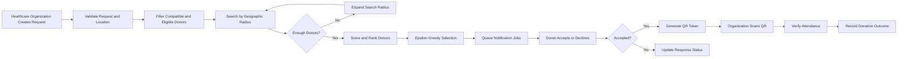
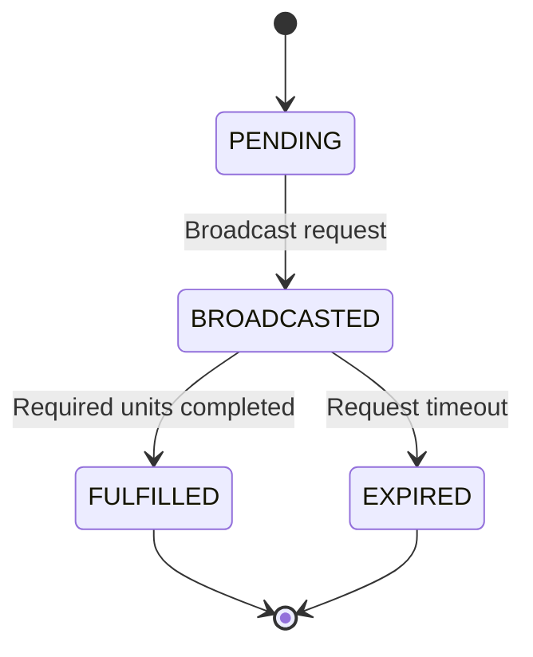
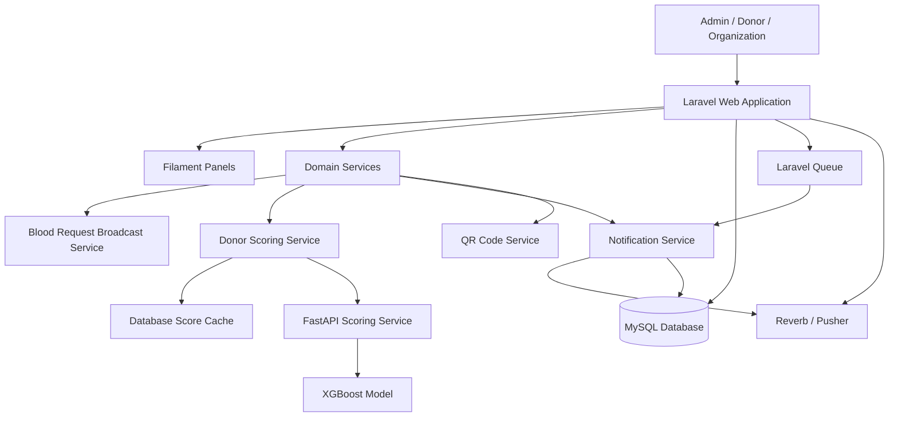
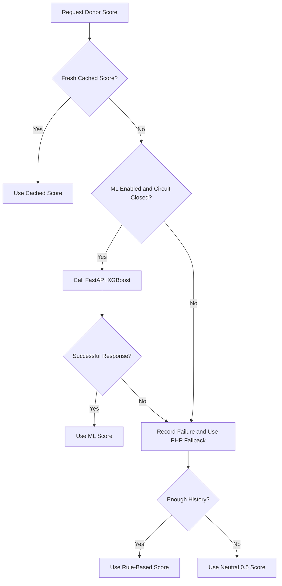

<div align="center">

# BloodBridge

### Intelligent Blood Donation Coordination Platform

A bilingual Laravel platform that helps healthcare organizations identify, prioritize, notify, and verify eligible blood donors through location-aware matching, asynchronous workflows, and resilient scoring.

[](https://laravel.com/)
[](https://www.php.net/)
[](https://filamentphp.com/)
[](https://www.mysql.com/)
[](https://fastapi.tiangolo.com/)
[](https://xgboost.ai/)
[](#license)

[Watch Demo](https://www.youtube.com/watch?v=y6ZVAuAgmOs) ·
[Report an Issue](../../issues)

</div>

---

## Overview

BloodBridge is a web-based blood donation coordination system designed for healthcare organizations and registered donors in the Gaza Strip.

The platform replaces fragmented coordination through phone calls, social media messages, and manual records with one structured workflow for:

- creating blood requests;
- discovering medically eligible donors;
- matching donors by blood compatibility and geographic proximity;
- prioritizing donors using behavioral scoring;
- dispatching notifications asynchronously;
- tracking donor responses;
- verifying attendance through QR codes;
- monitoring the complete request lifecycle.

BloodBridge supports Arabic and English and provides separate interfaces for administrators, donors, and healthcare organizations.

---

## The Problem

Blood donation coordination is highly time-sensitive. Manual communication creates several operational risks:

- suitable donors may not be reached quickly;
- the same donors may be contacted repeatedly;
- donor eligibility may be unclear;
- response history is difficult to track;
- organizations may lack visibility into request progress;
- attendance and completed donations may not be verified consistently.

BloodBridge addresses these issues through a traceable, resilient, and workflow-driven platform.

---

## Core Workflow



---

## Key Features

### Intelligent Donor Discovery

- ABO and Rh blood-type compatibility matching.
- Eligibility validation before donor selection.
- GPS-based proximity search using the Haversine formula.
- Bounding-box pre-filtering to reduce geographic query cost.
- Governorate-level fallback when exact coordinates are unavailable.
- Progressive radius expansion when the initial search does not return enough donors.

### Resilient Donor Scoring

BloodBridge uses a four-level scoring waterfall:

| Level | Scoring Source | Purpose |
|---|---|---|
| 1 | Cached database score | Reuses a recent score to reduce latency |
| 2 | FastAPI + XGBoost | Predicts donor response likelihood |
| 3 | Rule-based PHP score | Keeps scoring available when the ML service fails |
| 4 | Neutral fallback score | Prevents cold-start donors from being excluded |

The rule-based score considers:

```text
acceptance behavior
+ response recency
+ donation loyalty
- no-show penalties
```

A circuit breaker protects the broadcast workflow from repeated FastAPI failures. When the ML service becomes unavailable, donor selection continues automatically using the internal fallback.

### Balanced Donor Selection

An epsilon-greedy strategy balances:

- **exploitation** — prioritizing donors with stronger response scores;
- **exploration** — giving less-known or newly registered donors a fair opportunity.

The exploration ratio decreases gradually as more behavioral data become available.

### Asynchronous Notifications

- Notification delivery runs through Laravel queue jobs.
- Donors are processed in controlled batches.
- Eligibility is revalidated inside each job before sending.
- Notifications respect the recipient's preferred language.
- Database and real-time broadcast channels are supported.
- Laravel Reverb can be used locally and Pusher in hosted environments.

### QR-Based Attendance Verification

When a donor accepts a request:

1. the system creates a unique QR token;
2. the donor downloads the generated QR code;
3. the healthcare organization scans it on arrival;
4. the platform verifies token validity, organization ownership, expiry, and request context;
5. attendance is recorded with a verification timestamp.

The verification interface is rate-limited to reduce abusive scanning attempts.

### Request Lifecycle Automation

Blood requests and donor responses move through controlled status transitions.



Scheduled commands:

- expire outdated blood requests;
- mark stale responses as unreachable;
- cancel unnecessary pending responses;
- reduce the exploration ratio over time.

### Bilingual Experience

- Arabic and English interfaces.
- Per-user locale preference.
- Localized notifications.
- Translatable content and model attributes.
- Locale-aware public routes.

---

## User Panels

### Administrator Panel

Route: `/admin`

Administrators can:

- manage users, donors, organizations, and blood requests;
- approve or reject healthcare organizations;
- monitor platform activity;
- manage announcements and contact messages;
- configure eligibility and scoring settings;
- monitor ML service health and circuit-breaker state;
- review blood-type demand and request trends.

### Donor Panel

Route: `/donor`

Donors can:

- complete and update their profile;
- view eligibility status;
- review compatible active requests;
- accept, decline, or cancel responses;
- download QR verification codes;
- review donation and response history;
- track personal statistics.

### Healthcare Organization Panel

Route: `/org/{slug}`

Approved organizations can:

- create and broadcast blood requests;
- define blood type, urgency, units, location, and radius;
- review donor responses;
- scan donor QR codes;
- confirm attendance and donation outcomes;
- view organization-specific analytics.

The organization panel uses tenant isolation based on the organization slug.

---

## Architecture



### Main Architectural Components

- **Laravel application** — authentication, business logic, routing, validation, persistence, scheduling, and queues.
- **Filament panels** — role-specific administrative and operational interfaces.
- **MySQL** — donors, organizations, health profiles, blood requests, responses, settings, and audit data.
- **FastAPI service** — exposes the XGBoost scoring component through an HTTP API.
- **Queue workers** — process notification batches outside the request-response cycle.
- **Broadcasting layer** — delivers real-time updates through Reverb or Pusher.
- **Scheduler** — maintains request and response lifecycles automatically.

---

## Technical Highlights

### Geographic Matching

BloodBridge combines:

- blood compatibility;
- donor eligibility;
- GPS coordinates;
- Haversine distance calculation;
- bounding-box optimization;
- configurable search radius;
- automatic radius expansion;
- governorate fallback.

This avoids relying on blood type alone and makes the search process adaptive when donor availability is limited.

### Eligibility Engine

Donor eligibility is recalculated when a health profile is saved.

The evaluation considers:

- chronic disease;
- active infection;
- minimum weight;
- minimum height;
- recent donation;
- recent surgery.

The system stores:

- current eligibility;
- permanent or temporary restriction;
- next eligible donation date.

### Scoring Reliability

The scoring component is intentionally designed not to become a single point of failure.



### ML Validation

The current XGBoost model was evaluated on a held-out subset of a synthetic dataset created for controlled project validation.

| Approach | AUC-ROC | Accuracy |
|---|---:|---:|
| Random baseline | 0.4757 | 43% |
| Rule-based scoring | 0.8822 | 83% |
| XGBoost | 0.9262 | 81% |

AUC-ROC is the more relevant metric in this context because the model is used primarily for ranking donors by response likelihood rather than producing a final medical or eligibility decision.

> The model is a decision-support component, not a medical decision system. It should be retrained and revalidated using real operational data before production deployment.

---

## Tech Stack

| Layer | Technology |
|---|---|
| Backend | PHP 8.3+, Laravel 12 |
| Admin and User Panels | Filament 4 |
| Frontend | Blade, Alpine.js, Tailwind CSS 4, Vite |
| Database | MySQL |
| ORM | Eloquent |
| Queue | Laravel Queue |
| Broadcasting | Laravel Reverb / Pusher |
| Machine Learning Service | Python, FastAPI, XGBoost |
| QR Codes | Simple QrCode |
| Localization | Laravel Localization, translatable model fields |
| Settings | Spatie Laravel Settings |
| Testing | Pest |
| Code Quality | Laravel Pint |
| Version Control | Git, GitHub |

---

## Project Structure

```text
bloodbridge/
├── app/
│   ├── Console/Commands/
│   ├── Enums/
│   ├── Filament/
│   │   ├── Admin/
│   │   ├── Donor/
│   │   └── Organization/
│   ├── Jobs/
│   ├── Models/
│   ├── Notifications/
│   ├── Providers/Filament/
│   ├── Services/
│   └── Settings/
├── ai_service/
│   ├── app.py
│   ├── config.py
│   └── models/
├── database/
│   ├── migrations/
│   └── seeders/
├── routes/
│   ├── web.php
│   └── console.php
└── tests/
```

---

## Main Domain Services

| Service | Responsibility |
|---|---|
| `BloodRequestBroadcastService` | Discovers, scores, selects, and dispatches donors |
| `BloodRequestActionService` | Handles donor and organization request actions |
| `DonorScoringService` | Runs the scoring waterfall and donor ranking |
| `FastApiCircuitBreaker` | Prevents repeated calls to a failing ML service |
| `NotificationService` | Applies locale and delivers notifications consistently |
| `QRCodeService` | Generates and validates donor attendance tokens |

---

## Local Setup

### Requirements

- PHP 8.3+
- Composer 2
- Node.js 18+
- MySQL
- Python 3.10+ for the optional ML service

### Installation

```bash
git clone https://github.com/Adel-Shurrab/bloodbridge.git
cd bloodbridge

composer install
cp .env.example .env
php artisan key:generate

npm install
npm run build

php artisan migrate --seed
```

Configure the database and application values in `.env` before running migrations.

### Start Development Services

```bash
composer dev
```

Alternatively, start the services separately:

```bash
php artisan serve
php artisan queue:work
php artisan schedule:work
npm run dev
```

---

## FastAPI Scoring Service

The FastAPI component is optional because the Laravel application contains internal fallback scoring.

### Windows

```bash
cd ai_service
python -m venv venv
venv\Scripts\activate
pip install -r requirements.txt
uvicorn app:app --reload --port 8000
```

### Linux or macOS

```bash
cd ai_service
python3 -m venv venv
source venv/bin/activate
pip install -r requirements.txt
uvicorn app:app --reload --port 8000
```

Enable ML scoring through the administrator scoring settings after the service is running.

---

## Environment Configuration

Example values:

```env
APP_NAME=BloodBridge
APP_ENV=local
APP_URL=http://localhost
APP_LOCALE=en
APP_FALLBACK_LOCALE=en

DB_CONNECTION=mysql
DB_HOST=127.0.0.1
DB_PORT=3306
DB_DATABASE=bloodbridge
DB_USERNAME=root
DB_PASSWORD=

QUEUE_CONNECTION=database
CACHE_STORE=database
SESSION_DRIVER=database

BROADCAST_CONNECTION=reverb

REVERB_APP_ID=
REVERB_APP_KEY=
REVERB_APP_SECRET=

MAIL_MAILER=smtp
MAIL_HOST=
MAIL_PORT=
MAIL_USERNAME=
MAIL_PASSWORD=
MAIL_FROM_ADDRESS=
```

Never commit `.env`, credentials, private keys, or production data.

---

## Background Jobs and Scheduling

| Command | Schedule | Responsibility |
|---|---|---|
| `blood:cleanup-stale-responses` | Hourly | Marks stale donor responses as unreachable |
| `blood-requests:expire` | Twice daily | Expires outdated requests |
| `scoring:decay-epsilon` | Daily | Gradually reduces the exploration ratio |

Run the scheduler locally:

```bash
php artisan schedule:work
```

Run queue workers:

```bash
php artisan queue:work --tries=3
```

---

## Testing

Run the full test suite:

```bash
composer test
```

Or:

```bash
php artisan test
```

Run a specific test:

```bash
php artisan test tests/Feature/NotificationClassesTest.php
```

Code formatting:

```bash
./vendor/bin/pint
```

---

## Security and Reliability

BloodBridge includes:

- role-based access control;
- tenant isolation for healthcare organizations;
- donor email verification;
- organization approval workflow;
- QR verification rate limiting;
- token expiry and ownership validation;
- server-side eligibility checks;
- queue-time donor revalidation;
- controlled request status transitions;
- circuit-breaker fallback for the ML service;
- localized notification handling;
- protected administrative routes;
- environment-based secret management.

---

## Current Limitations

- The current ML model was trained on synthetic data and requires retraining with real operational data.
- The platform supports coordination but does not replace medical screening, laboratory testing, or professional healthcare judgment.
- Delivery effectiveness depends on network availability and user participation.
- External SMS or WhatsApp emergency notification channels are not yet part of the core implementation.
- The existing ML retraining endpoint is not yet connected to a complete automated retraining pipeline.

---

## Roadmap

- Progressive Web App support.
- Push notifications for offline users.
- SMS and WhatsApp emergency alerts.
- Real donor-data retraining pipeline.
- Shared Redis-backed circuit-breaker state for distributed deployment.
- Blood inventory monitoring.
- Donor achievements and gamification.
- Digital donor identification card.
- Expanded unit, feature, and integration test coverage.
- Deployment observability and structured operational metrics.

---

## Author

**Adel Shurrab**  
Laravel Backend Developer

- [LinkedIn](https://www.linkedin.com/in/adel-shurrab/)
- [GitHub](https://github.com/Adel-Shurrab)
- [Email](mailto:adelshurrab2003@gmail.com)

---

## License

This project is licensed under the MIT License.
